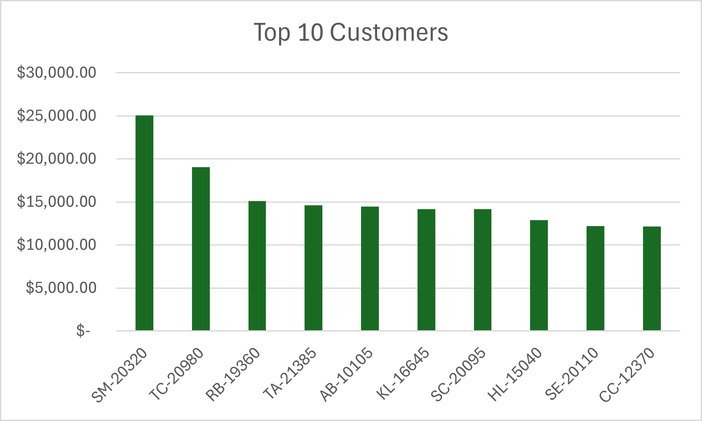

## 📊 Insights
- Total Sales = **$2.3M** with a profit of **$280K**
- The **West region** consistently outpreforms other regions in sales.
- **Cisco TelePresence System EX90 Videoconferencing Unit** is the best selling item.
- Our top 10 customers account for around **6.6%** of our total sales.
- Sales were the highest in November with a total of **$350K**.

# 🛒 Superstore SQL Analysis – Business Insights

## 📌 Project Summary
This analysis uses the **Superstore dataset** to explore sales, profit, customer behavior, product performance, and discount impact.
The goal is to demonstrate SQL querying skills and extract actionable business insights.

---

## 🔑 Key Insights

### 1. Overall Sales & Profit
- Total Sales: **$X,XXX,XXX**
- Total Profit: **$XXX,XXX**
- Overall Profit Margin: **X%**

➡️ *The company is profitable, but margins vary widely by category and region.*

---

### 2. Monthly Sales Trend
- Peak sales in **Month(s)**.
- Lowest sales in **Month(s)**.
- Noticeable **seasonal pattern/steady growth/decline**.

➡️ *Sales are strongest in Q4, suggesting reliance on holiday demand.*

---

### 3. Top Customers
- **Customer A** contributed **$XX,XXX** in sales.
- Top 10 customers account for **X% of total revenue**.

➡️ *Revenue is concentrated among a small group of high-value customers.*

---

### 4. Top Products
- **Product A** generated **$XX,XXX** in revenue.
- Certain categories (e.g., Technology) outperform others.

➡️ *High-performing products should be prioritized in inventory and promotions.*

---

### 5. Regional Performance
| Region | Sales | Profit |
|----------|------------|------------|
| West | $XXX,XXX | $XX,XXX |
| East | $XXX,XXX | $XX,XXX |
| Central | $XXX,XXX | $XX,XXX |
| South | $XXX,XXX | $XX,XXX |

➡️ *The **West** region leads in both sales and profitability, while the **South** underperforms.*

---

## 🚀 Recommendations
1. Focus on **high-performing customers** with loyalty programs.
2. Expand **technology category** products, as they yield higher profit margins.
3. Allocate more resources to the **West region** where performance is strongest.
